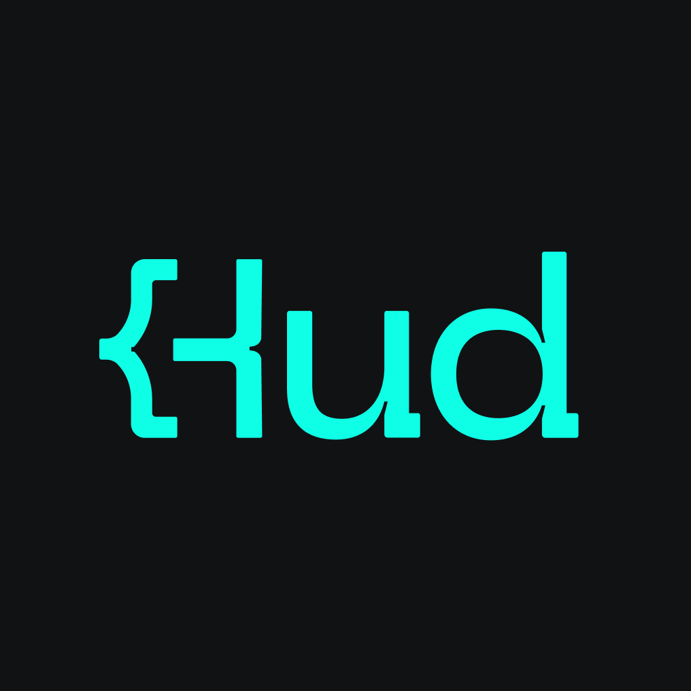

<p align="center"></p>

# Hud plugin for AI coding agents

The official [Hud](https://hud.io) plugin for Claude Code, Cursor and Codex. It connects your coding agent to Hud's Runtime Code Sensor, so it can see how your code actually behaves in production (function-level invocations, latency, errors, deployments, forensics) while it writes and fixes code.

One install gives you:

- **Hud MCP server** (hosted at `https://mcp.hud.io/mcp`, OAuth sign-in with your Hud account, nothing to install locally)
- **A `hud` skill** that tells the agent when to reach for Hud, how to start (schema first, then the server's playbooks via `hud-get-skill`), and how to sign in. The investigation playbooks themselves (endpoint errors, slow endpoints, deployment impact, forensics) are served by the Hud MCP, so they stay current without updating the plugin.

**Prerequisites:** a [Hud account](https://app.hud.io) and the Hud SDK installed in your services ([docs](https://docs.hud.io)).

## Install

### Claude Code

```
/plugin install hud --marketplace hud-hq/hud-agent-plugin
```

Or from the terminal:

```bash
claude plugin marketplace add hud-hq/hud-agent-plugin && claude plugin install hud@hud
```

Then run `/mcp`, select **hud** and sign in.

### Cursor

Install **Hud** from the [Cursor Marketplace](https://cursor.com/marketplace), then toggle **hud** on in **Settings → Tools & MCP** and sign in.

MCP only (no skills), one click:

[](cursor://anysphere.cursor-deeplink/mcp/install?name=hud&config=eyJ1cmwiOiJodHRwczovL21jcC5odWQuaW8vbWNwIiwiYXV0aCI6eyJDTElFTlRfSUQiOiJYeXZENk5hUEdicnBPTDlteGdscTdLVVl1UFhieU5CNCJ9fQ==)

### Codex

```bash
codex plugin marketplace add hud-hq/hud-agent-plugin
```

Open `/plugins` in Codex, install **Hud**, then run `codex mcp login hud` to sign in.

## Try it

- "Why is `/api/checkout` failing in production?"
- "Did the 14:00 deployment cause a regression?"
- "Which endpoints call the function I'm about to change?"

## CI and headless agents

OAuth is for people. For CI, background agents and containers, connect with an API key instead (keys at [app.hud.io/settings/api-keys](https://www.app.hud.io/settings/api-keys)):

```bash
claude mcp add --scope user -t http hud https://mcp.hud.io/mcp -H "X-Hud-Mcp-Key: <your key>"
```

See [Hud Remote MCP](https://docs.hud.io/docs/remote-mcp) for Cursor and other clients.

## Repo layout

One repo, three manifests, one shared `skills/` directory:

```
.claude-plugin/plugin.json, marketplace.json   Claude Code (Codex also reads the marketplace)
.codex-plugin/plugin.json                      Codex
.cursor-plugin/plugin.json                     Cursor
.mcp.json                                      MCP config for Claude Code
agents/codex/mcp.json                          MCP config for Codex (fixed OAuth callback URL)
agents/cursor/mcp.json                         MCP config for Cursor (Cursor's OAuth field format)
skills/                                        Skills shared by all three
```

The MCP config is split per agent because each one spells static OAuth client settings differently.

## Data and privacy

- The plugin itself contains no code that runs on your machine. It configures your agent to talk to Hud's hosted MCP server (`https://mcp.hud.io/mcp`) and adds instruction skills.
- When the agent calls a Hud tool, the tool arguments (for example SQL queries over your Hud runtime data, function or service names) are sent to Hud, and results from your Hud account are returned to the agent.
- Access requires signing in with your Hud account (OAuth) or a Hud API key. You only see data your Hud account can already access.
- Hud's [privacy policy](https://www.hud.io/legal/privacy-policy/) and [terms of service](https://www.hud.io/legal/terms-of-service/) apply.

## Support

[docs.hud.io](https://docs.hud.io) · support@hud.io · [support chat](https://www.app.hud.io/?support_chat=true)
